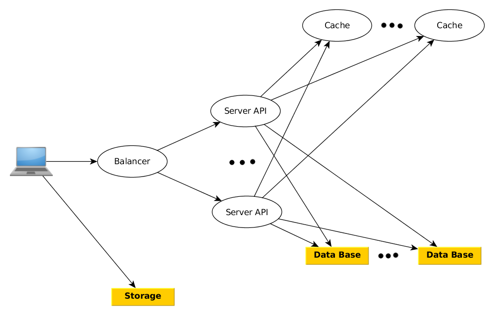

# Audio-service

## Задачи

1. Прослушивание музыки
2. Создание плейлистов
3. Поиск песен
    * по исполнителю
    * по названию
    * по жанру
    * по году

## Архитектура

## Хранение данных

* Бинарные файлы - на жёстких дисках (хранилища типа amazon s3)
* Информация о песнях - в NoSQL базе данных (возможно MongoDB)
   
   Хранятся следующие сущности:
   * Аудиозапись
      * id
      * название
      * исполнитель
      * жанр
      * год
      * альбом
      * текст
      * длительность
      * ссылка
      * доступность
   * Плейлист
      * id
      * массив id аудиозаписей
   * Пользователь
      * id
      * массив id плейлистов

* Кэш: пары запрос-ответ по принципу LRU

## Технологии
   * REST ful service

## API
Решено сделать RESTful сервис, поэтому REST API: [Swaggerhub](https://app.swaggerhub.com/apis/vaddya/audio-service/1.0.0)

## Поиск
Поиск будет осуществляться по 4 параметрам:
* название
* исполнитель
* жанр
* год

В полях жанр и год будет учитываться только точное совпадение.
В полях название, исполнитель, альбом будет учитываться неполное совпадение.

Для работы с нечеткими поисковыми запросами предлагается использовать алгоритм, подсчитывающий расстояние Дамерау-Левенштейна.
Расстояние Дамерау-Левенштейна - минимальное количество операций, необходимых для превращешия одной строки в другую.
Операцией считается: вставки символа, удаления символа, замены символа на другой, перестановка двух соседних символов.

Каждое поле поискового запроса будет сравниваться с соответствующим полем записи в БД. Записи в ответе будут упорядочены по увеличению суммарного расстояния Дамерау-Левенштейна до поискового запроса. 

## Взаимодействие со сторонними сервисами

1. Авторизация
2. Пользователи
3. Счётчики числа прослушивания песен 

## TODO
* кривые поисковые запросы
* отказоустойчивость(репликации и все такое)

